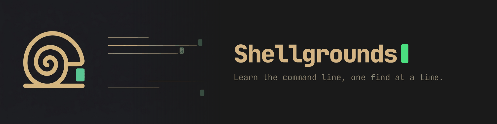

# Shellgrounds — learn the command line, one find at a time

<p align="center">
  <picture>
    <source media="(prefers-color-scheme: light)" srcset="docs/images/shellgrounds-banner-light.png">
    
  </picture>
</p>

<p align="center">
  <a href="https://github.com/jamestwebb/shellgrounds/actions/workflows/ci.yml"></a>
  <a href="LICENSE.md"></a>
  <a href="#running-it-on-your-own-machine"></a>
  <a href="docs/FAQ.md"></a>
</p>

<p align="center">
  <a href="#deploy-it-for-your-class">Deploy it</a> ·
  <a href="docs/FAQ.md">FAQ</a> ·
  <a href="docs/CAMPAIGNS.md">Campaigns</a> ·
  <a href="docs/TEACHING.md">Teaching with it</a> ·
  <a href="packs/AUTHORING.md">Write a campaign</a> ·
  <a href="docs/PACK-FORMAT.md">Pack format</a> ·
  <a href="docs/ACCESSIBILITY.md">Accessibility</a>
</p>

**A free command-line training ground for high school and university technology educators.**
Real bash and Windows CMD, in a browser, with no lab of virtual machines to build, patch
and rebuild every term. [Set it up in twenty minutes →](#deploy-it-for-your-class)

**Key features**

- **Linux and Windows, in one place.** Three campaigns included — 106 challenges and 143
  distinct skills across `bash`, Windows `cmd`, and a forensics campaign that crosses
  between the two over WSL.
- **Build your own campaign.** A campaign — a *pack*, in the code — is a folder of JSON:
  networking, git, SQL, whatever your syllabus actually needs. `npm run validate`
  machine-proves every challenge solvable before a class ever sees it.
- **Nothing for students to install, nothing for you to administer.** A static site on a
  free tier — no virtual machines, no containers, no lab images, and no per-student
  accounts to provision. Deploying it needs a GitHub and a Netlify account and no software.
- **No student data beyond a handle they choose.** No email, no real name, no roster, no
  analytics, no third-party scripts. That is the whole answer to the privacy question.
- **Answers cannot be passed around.** Every find is generated from the student's own
  handle, so the string that scores for one student scores for nobody else.
- **A shared picture by default, a leaderboard only if you want one.** Every find turns
  over one square of a class image: names show, nothing is ranked, and it finishes well
  before the slowest student does. A public ranking pushes students toward looking
  competent rather than becoming competent — and being shown as 23rd of 24 confirms exactly
  what a frightened first-year already suspected. Switch to a board in one click; the full
  ranking and the gradebook stay in the instructor console either way.
- **WCAG 2.1 AA, and honest about the gaps.** Six terminal schemes, all contrast-tested at
  4.5:1; colour is never the only signal. What is unfinished is
  [listed by name](docs/ACCESSIBILITY.md).


<sub>Act I of the forensics campaign, in practice mode. The terminal is simulated in the
browser — nothing is executed on a server, and there is no server to execute it on.</sub>

---

## Deploy it for your class

[](https://app.netlify.com/start/deploy?repository=https://github.com/jamestwebb/shellgrounds)

Clicking the button makes your own copy of the code, builds it, and puts it on the web at
a free `*.netlify.app` address. On the way through, Netlify asks you for three things:

| Setting | What to put in it |
| :--- | :--- |
| `CLASS_PASSWORD` | The password you tell your class. Students type it once, to create their handle. |
| `ADMIN_HANDLES` | Your own handle, so the site shows you the instructor view. Comma-separated for more than one teacher: `ms_okafor,ta_alex`. |
| `INSTRUCTOR_SETUP_CODE` | A second, private password only you know. It stops a student claiming the teacher handle before you do. Make it different from the class password, and do not announce it. |

### After the first deploy — two more steps

1. **Add a signing key.** In the Netlify dashboard, open **Site configuration ->
   Environment variables** and add `SESSION_SECRET`. It must be a long random string.
   On a Mac or Linux machine, `openssl rand -hex 32` prints one. Any long jumble of
   letters and numbers works. Then redeploy (**Deploys -> Trigger deploy**).
2. **Claim your handle.** Open the site, enter your handle from `ADMIN_HANDLES`, the class
   password, and — under **I am the instructor** — your setup code. You now see the
   instructor view.

Then give your class the site address and the class password. That is the whole setup.

### One name to change only between terms

`SHELLGROUNDS_STORE` names the storage area holding every handle, solve, and score. You do
not have to set it: it has a working default. Change the value and the site starts reading
a fresh, empty store, and every score already recorded becomes invisible — it is still on
disk, but the site no longer looks there. So change it once, at the start of a term, and
never in the middle of one.

If you deployed this site before it was renamed from The Gauntlet, you may have a
`GAUNTLET_STORE` variable. It still works and your scores are safe. Leave it, or copy its
value into `SHELLGROUNDS_STORE` and delete the old one.

---
## What your students get

Three campaigns ship with the site — **106 challenges** in total. Students switch between
them from the header, and each is a full campaign with its own machine, its own story and
its own badges.

| Campaign | Size | Platform | Start here if |
|---|---|---|---|
| **Linux Fundamentals: The Night Shift** — overnight operator at an observatory | 46 challenges · 4 acts | Linux | your class has never used a terminal. It begins at `pwd` and ends with a student writing a pipeline. |
| **Windows CMD Essentials: Lost & Found** — identify an unclaimed laptop | 30 challenges · 3 acts | Windows | you teach Windows administration. Real `cmd.exe`, not bash wearing a `C:\` prompt. |
| **Forensics CLI 101: The Aurora Case** — a case worked from the bench to a carved disk image | 30 challenges · 6 acts | Both, over WSL | your students already have the basics. Written for a cyber-forensics course. |

**[Read what each act teaches →](docs/CAMPAIGNS.md)**

**[Running it with a class →](docs/TEACHING.md)** — choosing which campaigns your class
sees, whether they get a shared picture or a leaderboard, and the design decisions behind
both: different finds per student, a free first hint on every challenge, one skip per act,
and no timers anywhere.

## Running it on your own machine

You do not need any of this to teach with Shellgrounds. It is here for people writing
their own packs.

```bash
npm install       # install dependencies
npm run dev       # start the dev server
npm test          # unit, de-branding, and fidelity tests
npm run validate  # prove every challenge in every pack is solvable
npm run build     # production build
```

The pack validator also runs standalone, and takes a single pack:

```bash
node bin/shellgrounds.js validate
node bin/shellgrounds.js validate packs/linux-fundamentals --json
```

---

## Contributing

Issues and pull requests are welcome, particularly content packs — a campaign for
networking, for git, for SQL, for whatever you actually teach. See
[`packs/AUTHORING.md`](packs/AUTHORING.md) to build one, and run `npm run validate`
before opening a PR: it machine-proves every challenge in your pack is solvable and
reports the mistakes that are easy to make and hard to see.

**AI-assisted PRs are welcome.** Say so in the description, and hold the work to the
same bar as anything else: it should be tested, it should explain *why* in its comments,
and you should have read it.

## Thanks

**[Netlify](https://github.com/netlify).** This project rests on their free tier, and the
shape of the product follows from it: a static site, serverless functions and a key-value
store, at no cost and with no card on file. That is why a teacher can run this without a
budget line, a purchase order or a conversation with procurement — which for most schools
is the difference between using something and not.

**[shields.io](https://shields.io)** for the badges above, and
**[JetBrains Mono](https://www.jetbrains.com/lp/mono/)** for every character a student types.

## License

**PolyForm Noncommercial License 1.0.0** — full text in [LICENSE.md](LICENSE.md).

Plain English. This summary is not a substitute for the licence itself:

- **Teachers and schools may use this, free of charge.** The licence names educational
  institutions as a permitted use *"regardless of the source of funding"*. Public schools,
  private schools, colleges, and universities are all covered, as are non-profits and
  government bodies.
- **You may change it and share your changes.** Fork it, write your own content packs,
  deploy it for your class, hand it to a colleague.
- **Keep the attribution.** Anyone who gets a copy from you must also get the licence and
  the `Required Notice:` line that names the copyright holder.
- **No commercial use.** You may not sell this, or sell a service built on it, without a
  separate licence from the copyright holder.

This is a *source-available* licence, not an OSI-approved open-source one. The
non-commercial restriction is deliberate. If you need commercial terms, ask.

Copyright (c) 2026 Rational Mystic LLC.
